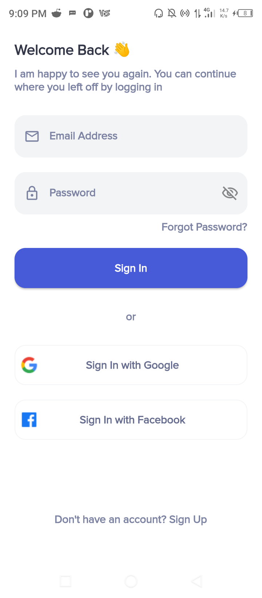
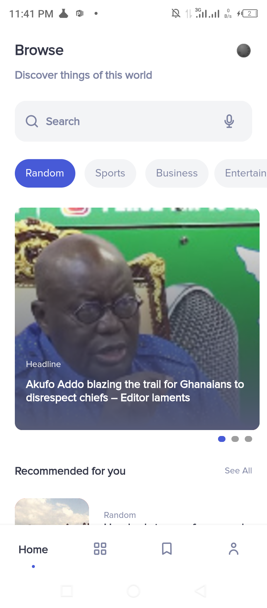
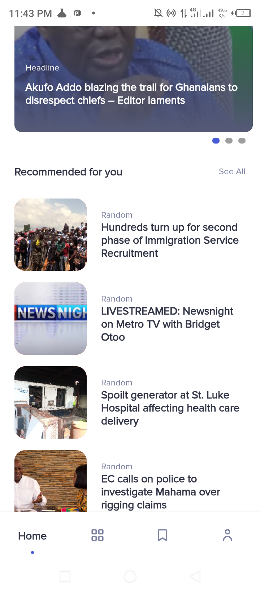
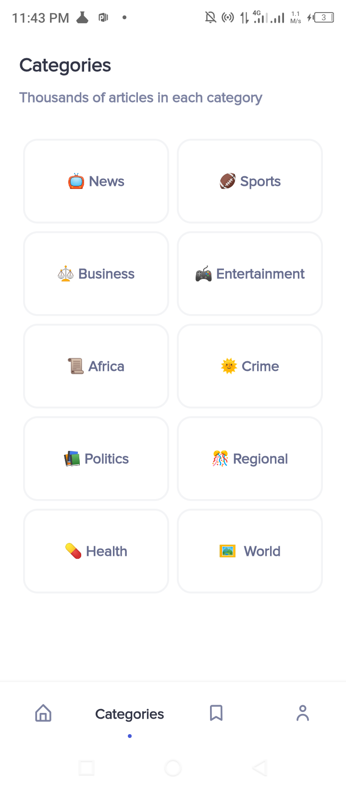
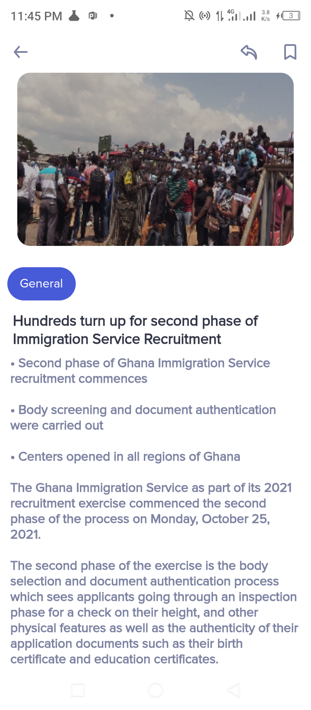
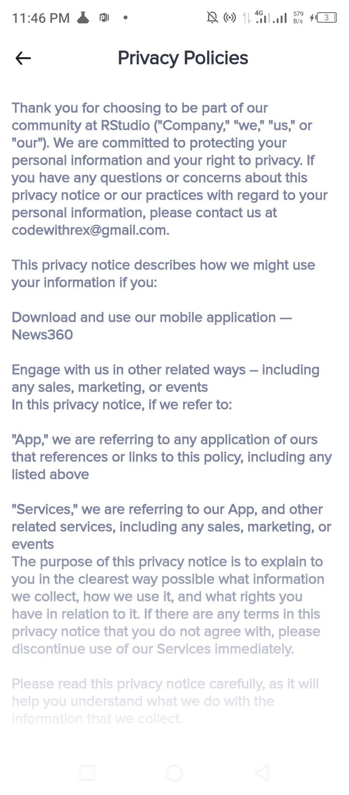
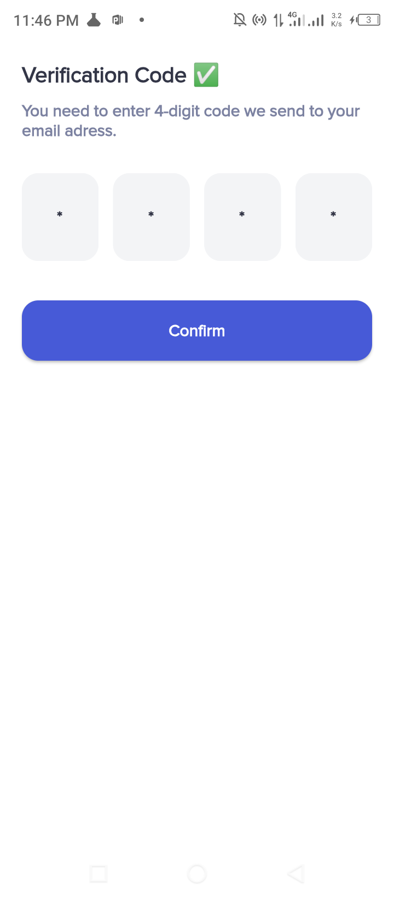
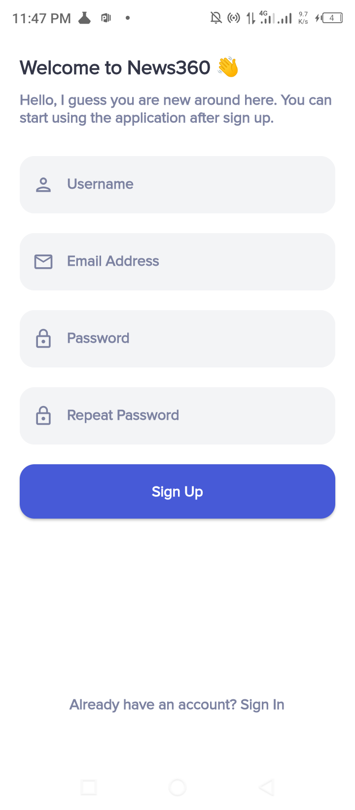

<h1 align="center">Welcome to News360 👋</h1>

  
  
  

> Mobile App that gives ghana updated news scrap from GhanaWeb.

### 🏠 [Overview](https://github.com/Rexfordasamoah51/News360)

News360 is a mobile app built with Flutter. Due to fewer couple data around for building news app for my country. I try using the magic of dart Scraping in order for me to populate the data inside the app. The source data is streamed from Ghanaweb.com

### ✨ [Demo](https://github.com/Rexfordasamoah51/News360/releases/tag/news)
https://user-images.githubusercontent.com/36260221/138882649-7b026bfe-a4ed-4a6a-b3e2-69ebd74cc1d7.mp4
## 💥Feature Screenshot

  Made with        💙     |  with Flutter
:-------------------------:|:-------------------------:
 | 
 |
 |
|
|
|
|

> The app has some screen which wasn't feature here. Therefore you can dowmload it yourself and see the experince

## 💌 Author

👤 **Rexford Asamoah**

* Twitter: [@Rexthedev](https://twitter.com/Rexthedev)
* Github: [@Rexfordasamoah51](https://github.com/Rexfordasamoah51)
* LinkedIn: [@rexfordasamoah](https://linkedin.com/in/rexfordasamoah)

# License

    Copyright 2021 Rexford Asamoah

    Licensed under the Apache License, Version 2.0 (the "License");
    you may not use this file except in compliance with the License.
    You may obtain a copy of the License at

       http://www.apache.org/licenses/LICENSE-2.0

    Unless required by applicable law or agreed to in writing, software
    distributed under the License is distributed on an "AS IS" BASIS,
    WITHOUT WARRANTIES OR CONDITIONS OF ANY KIND, either express or implied.
    See the License for the specific language governing permissions and
    limitations under the License.

## Show your support

Give a ⭐️ if this project helped you!
